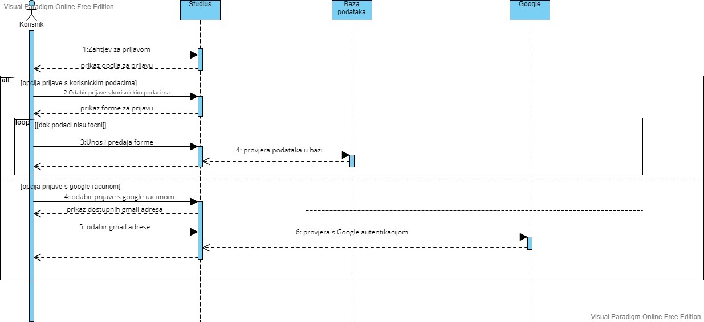
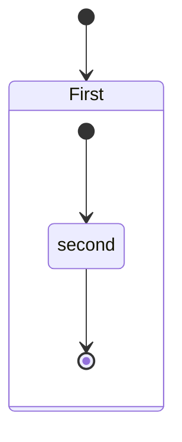

::: warning
_here be dragons_
:::

# test

asd

# test2

@startuml
Bob -[#red]> Alice : hello
Bob -[#red]> Alice : hello2()
Tester -[#red]> Bob : hello2()
Alice -[#0000FF]->Bob : ok
@enduml

```mermaid
stateDiagram
    [*] --> First
    state First {
        [*] --> second
        second --> [*]
    }
```
